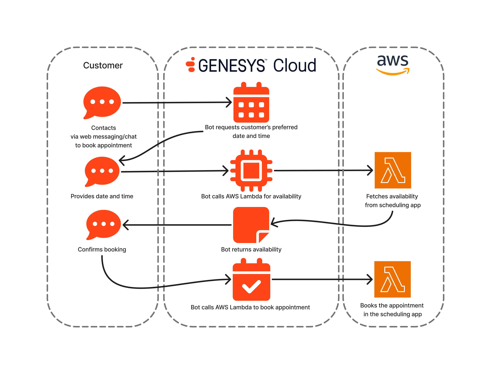

# Build a Scheduling Bot

This blueprint provides a bot flow that books an appointment to a user. Connected with AWS Lambda that calls a scheduling application, the bot highlights conversational AI integration with back-end services, offering a reusable pattern for scheduling scenarios across industries like healthcare, financial, customer services, etc.

The blueprint [documentation can be seen here](blueprint/index.md "Goes to the blueprint documentation").
