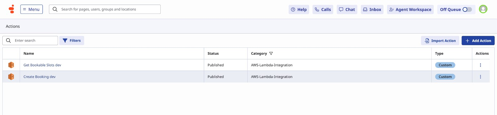
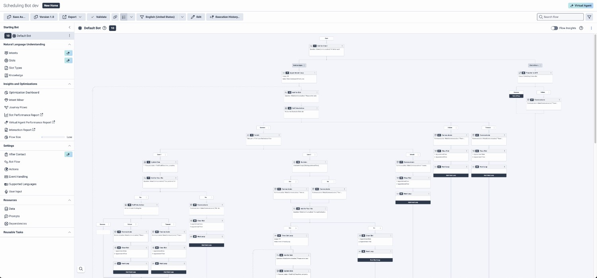
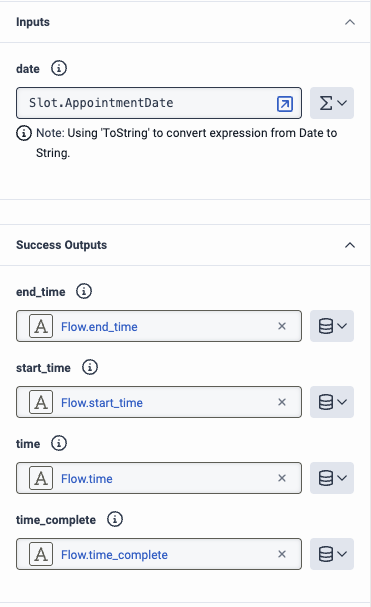
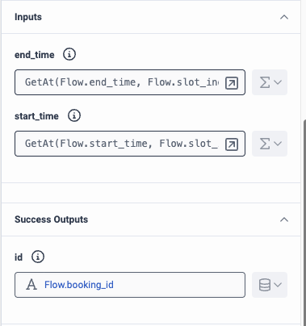
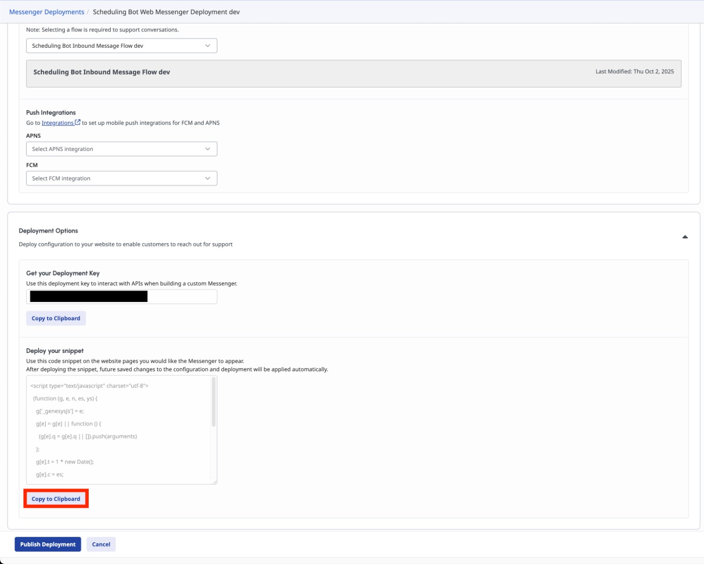
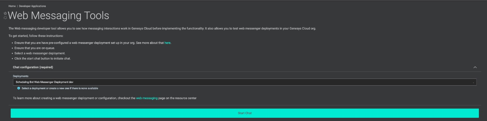

Scheduling appointments between customers and businesses is a common event. This type of interaction usually happens within websites or person-to-person interactions. This Genesys Cloud Blueprint provides an inbound message flow with a bot that books an appointment. This bot invokes an AWS Lambda (can also be an API call) to fetch available slots and books the desired slot. The bot also utilizes Genesys' conversational AI integration that allows the bot to easily converse with the user—making the booking process efficient for customers and also to the business.


## Solution Components

- **Genesys Cloud** - a suite of Genesys cloud services for enterprise-grade communications, collaboration, and contact center management.
  - **CX as Code** - a tool to declaratively manage Genesys Cloud resources and configuration across organizations using Terraform by HashiCorp.
  - **Data Action** - Provides the integration point to invoke a third-party REST web service or AWS lambda.
  - **Architect flows** - A flow in Architect, a drag and drop web-based design tool, dictates how Genesys Cloud handles inbound or outbound interactions.
  - **Web messaging and messenger** - The Genesys Cloud messaging platform that enables asynchronous conversations and a unified agent and supervisor experience across all Genesys Cloud messaging channels.
- **[Node.js](https://nodejs.org/en/ "Opens the NodeJs website")** - An open-source, cross-platform JavaScript runtime environment.
- **[AWS Lambda](https://aws.amazon.com/lambda/ "Opens the AWS Lambda website")** - A serverless computing service for running code without creating or maintaining the underlying infrastructure.
- **[Hapio](https://hapio.io/ "Opens the Hapio website")** - A scheduling and booking API for all kinds of applications, use cases, implementations and industries.

## Prerequisites

- Specialized Knowledge
  - Administrator-level knowledge of Genesys Cloud.
  - Basic knowledge of Genesys Cloud Architect.
  - Basic knowledge of the Genesys Cloud API.
  - Basic knowledge of AWS.
  - Basic knowledge of Node.js.
- Genesys Account Requirements
  - A Genesys Cloud license (CX 1 Digital or greater). For more information, see [Genesys Cloud Pricing](https://www.genesys.com/pricing "Goes to the Genesys Cloud Pricing page").
  - Master Admin role in Genesys Cloud. For more information, see [Roles and permissions overview](https://help.genesys.cloud/?p=24360 "Goes to the roles and permissions overview in the Genesys Cloud Resource Center") in the Genesys Cloud Resource Center.
  - [OAuth Client](https://help.genesys.cloud/articles/create-an-oauth-client/ "Goes to the Create an OAuth Client article") with the Master Admin role.
- AWS Account Requirements
  - Account role that has access to AWS Lambda.
- Hapio Account Requirements
  - an account that can generate an API Key.

## Implementation Steps

This blueprint has 2 implementation steps that allows you to do this manually or use Terraform _(which is highly recommended)_.

- [Preparation Steps](#preparation-steps "Goes to the Preparation Step section")
    1. [Clone the repository](#clone-the-repository "Goes to the Clone the Repository section")
    2. [Install Dependencies](#install-dependencies "Goes to the Install Dependencies section")
- [Manual Implementation](#manual-implementation "Goes to the manual implementation section")
    1. [Create the necessary resources in Hapio](#create-the-necessary-resources-in-hapio "Goes to the Create the necessary resources in Hapio section")
    2. [Create AWS Lambda Integration](#create-aws-lambda-integration-in-genesys-cloud "Goes to the Create AWS Lambda Integration section")
    3. [Create the Lambda](#create-the-lambda "Goes to the Create the Lambda section")
    4. [Create and Import the Data Actions](#create-and-import-the-data-actions "Goes to the Create and Import the Data Actions section")
    5. [Create and Import the Bot Flow and Inbound Message Flow](#create-and-import-the-bot-flow-and-inbound-message-flow "Goes to the Create and Import the Bot Flow and Inbound Message Flow section")
    6. [Create the Messaging Configuration and Deployment](#create-the-messaging-configuration-and-deployment "Goes to the Create the Messaging Configuration and Deployment section")
- [Using Terraform](#using-terraform "Goes to the Using Terraform section")
    1. [Create a Hapio API Key](#create-a-hapio-api-key "Goes to the Create a Hapio API Key section")
    2. [Create a Genesys Cloud OAuth Client](#create-a-genesys-cloud-oauth-client "Goes to the Create a Genesys Cloud OAuth Client section")
    3. [Run the Typescript Project that generates Hapio resources](#run-the-typescript-project-that-generates-hapio-resources "Goes to the Run the Typescript Project that generates Hapio resources section")
    4. [Compile the Lambda Source Code](#compile-the-lambda-source-code "Goes to the Compile the Lambda Source Code section")
    5. [Configure the Terraform Project](#configure-the-terraform-project "Goes to the Configure the Terraform Project section")
    6. [Run Terraform](#run-terraform "Goes to the Run Terraform section")
- [Deployment and Testing](#deployment-and-testing "Goes to the Deployment and Testing section")

## Preparation Steps

### Clone the Repository

Clone the [scheduling-bot-blueprint](https://github.com/GenesysCloudBlueprints/scheduling-bot-blueprint "Goes to the scheduling-bot-blueprint repository in GitHub") repository in your local machine. You can also run this git command to clone the repository:

```bash
git clone https://github.com/GenesysCloudBlueprints/scheduling-bot-blueprint.git
```

### Install Dependencies

This blueprint requires the following tools to be installed on your local machine:

- [Terraform](https://developer.hashicorp.com/terraform "Goes to the Terraform website") - for the [Using Terraform](#using-terraform "Goes to the Using Terraform section") step.
- [AWS CLI](https://docs.aws.amazon.com/cli/latest/userguide/getting-started-install.html "Goes to the installation instructions of AWS CLI") - will be needed in Terraform to provide AWS credentials.
- [Node.js](https://nodejs.org/en/ "Opens the NodeJs website") - LTS or version 20 or greater.

## Manual implementation

### Create the necessary resources in Hapio

Hapio's [Getting Started](https://hapio.io/uploads/2024/06/Getting-started-with-Hapio.pdf "Goes to the PDF document from Hapio"), provides a comprehensive guide on how to start with it. It includes registration, creation of API Token, and creation of resource, service, location, and etc. to get you a running scheduling and booking application.

In this blueprint you may create one (1) resource, service, location where the given schedule of the service is Mondays-Fridays, 9AM-6PM. The service implemented is the same in the guide.

This blueprint also provides a [Typescript project that generates the Hapio resources](#run-the-typescript-project-that-generates-hapio-resources).

Do take note of the ids of the generated resource, service, and location.

### Create AWS Lambda Integration in Genesys Cloud

This step is important so that Genesys Cloud can invoke the Lambda that we'll be creating. You need to [create IAM resources to invoke an AWS Lambda function](https://help.genesys.cloud/articles/create-iam-resources-to-invoke-an-aws-lambda-function/ "Goes to the Create IAM resources to invoke an AWS Lambda function article in Genesys Cloud Resource Center"). Once you have created that, instructions on [how to create the integration can be seen here](https://help.genesys.cloud/articles/add-a-data-actions-integration/#tab2 "Goes to the Add a data actions integration article in Genesys Cloud Resource Center").

### Create the Lambda

#### Building the Source Code

Go to the `src/typescript-lambda` folder and initialize the project by running the command `npm install`. After that, you may run the command `npm run build-lambda` to compile the project and will generate a `lambda.zip` file that you will use for deployment.

#### Uploading the Source Code

AWS has provided a [documentation on how you would deploy your source code to a Lambda function](https://docs.aws.amazon.com/lambda/latest/dg/nodejs-package.html#nodejs-package-create-update "Goes to the AWS Lambda Developer Guide on Deploy Node.js Lambda functions with .zip file archives"). Ensure that the function that you will create has a Node.js runtime.

#### Provide the Environment Variables

Once you have deployed the code, go to your function. Then go to **Configuration** > **Environment Variables**, and set the following keys with the appropriate values:

- `HAPIO_API_ACCESS_TOKEN`
- `HAPIO_LOCATION_ID`
- `HAPIO_SERVICE_ID`

:::primary
**Note**: The placement of the API Token in this Lambda function as an Environment Variable is **not recommended for implementation in a production environment**. You may use other tools to store the API Token more securely like storing and retrieving it with AWS Secrets Manager.
:::

### Create and Import the Data Actions

All Data Actions to import (that are in JSON files) are in the `/exports` folder in the [blueprint repository](#clone-the-repository "Goes to the Clone the Repository section") namely:

- `GetBookableSlotsDataAction.json`
- `CreateBookingDataAction.json`

You can import these data actions using the following steps:

1. In Genesys Cloud, navigate to **Admin** > **Integrations** > **Actions** and click **Import**.
2. Select the json files and associate with **AWS Lambda Integration** data action integration.
3. Click **Import Action**.
4. Provide the arn of the [Lambda we just created](#create-the-lambda "Goes to the Create the Lambda section") in the **Request URL Template** in the **Configuration** section.
5. Click **Save & Publish**.



### Create and Import the Bot Flow and Inbound Message Flow

There are three additional files in the `/exports` folder in the [blueprint repository](#clone-the-repository "Goes to the Clone the Repository section") that contains the flows needed:

1. `SchedulingBot.i3BotFlow` - the bot flow itself that asks the user on what they want to do. They can either book an appointment or chat to an agent that will be routed to a given queue.

2. `SchedulingBotInboundMessageFlow.i3InboundMessage`- the inbound message flow that utilizes the bot flow.

#### Import the Bot Flow

1. In Genesys Cloud, navigate to **Admin** > **Architect** > **Flows:Bot Flow** and click **Add**.

2. Enter a name for the inbound message flow and click **Create Flow**.

3. From the **Save** menu, click **Import**.

4. Select the `SchedulingBot.i3BotFlow` file from `/exports` and click **Import**.

5. Ensure that the data actions in the bot flow are connected to the [data actions we just created](#create-and-import-the-data-actions "Goes to the Create and Import the Data Actions section") and have the given Inputs and Success Outputs. The queue should also be changed to the queue that you want the flow to be routed to.

6. Click **Save** and then click **Publish**.



##### Input and Success Outputs for Get Bookable Slots Data Action



##### Input and Success Outputs for Create Booking Data Action



:::primary
**Note**: `end_time` is an expression of `GetAt(Flow.end_time, Flow.slot_index)` and `start_time` is an expression of `GetAt(Flow.start_time, Flow.slot_index)`
:::

#### Import the Inbound Message Flow

1. In Genesys Cloud, navigate to **Admin** > **Architect** > **Flows:Inbound Message Flow** and click **Add**.

2. Enter a name for the inbound message flow and click **Create Flow**.

3. From the **Save** menu, click **Import**.

4. Select the `SchedulingBotInboundMessageFlow.i3InboundMessage` file from `/exports` and click **Import**.

5. Click the `Call Bot Flow` step and select the [bot that we just created](#import-the-bot-flow "Goes to the Import the Bot Flow section").

6. Click **Save** and then click **Publish**.

### Create the Messaging Configuration and Deployment

#### Messenger Configuration

1. In Genesys Cloud, navigate to **Admin** > **Message** > **Messenger Configurations** and click **New Configuration**.
2. Fill in the configuration based on your needs.
3. Click **Save New Version**.

#### Messenger Deployment

1. In Genesys Cloud, navigate to **Admin** > **Message** > **Messenger Deployments** and click **New Deployment**.
2. In **Select your Configuration**, select the **Messenger Configuration** you made previously.
3. In **Select your Architect Flow**, select the [inbound message flow created](#import-the-inbound-message-flow "Goes to the Import the Inbound Message Flow section").
4. Click **Save**.

## Using Terraform

### Create a Hapio API Key

The creation of the API can be seen on Hapio's [Getting Started](https://hapio.io/uploads/2024/06/Getting-started-with-Hapio.pdf "Goes to the PDF document from Hapio"). Do take note of and store securely the generated API Key.

### Create a Genesys Cloud OAuth Client

The use of an OAuth Client is required for Terraform to create your Genesys Cloud resources. Instructions on how to create one is in this [article](https://help.genesys.cloud/articles/create-an-oauth-client/ "Goes to create an OAuth Client in Genesys Cloud Resource Center"). Do take note of and store securely both the generated `Client ID` and `Client Secret`.

### Run the Typescript Project that generates Hapio resources

Go to the `src/typescript-hapio-init` folder and initialize the project by running the command `npm install`.

Go to `src/typescript-hapio-init/src/index.ts` and provide the API Token in the `hapio_access_token`. You may also modify the `performOperations()` to modify the details to the resource, service, location, etc.

Once you have done those, run the command `npm run local` to run the script. Once the script ran successfully, the console will output the ids of the resource, service, and location. Do take note of these ids.

:::primary
If there is an instance that the API definition of Hapio is updated, you may update the typescript types by running the command `npx openapi-typescript https://docs.hapio.io/hapio-api-definition/Hapio-API.v1.yaml -o ./src/types/hapio-api.ts`
:::

### Compile the Lambda Source Code

Go to the `src/typescript-lambda` folder and initialize the project by running the command `npm install`. After that, you may run the command `npm run build` to compile the project to be deployed in Lambda.

### Configure the Terraform Project

#### Configure the environment variables

In the root directory of the repository, set the following environment variables in your local machine's terminal window before you run this project using the Terraform provider:

- `GENESYSCLOUD_OAUTHCLIENT_ID` - This variable is the Genesys Cloud client credential grant Id that CX as Code executes against.
- `GENESYSCLOUD_OAUTHCLIENT_SECRET` - This variable is the Genesys Cloud client credential secret that CX as Code executes against.
- `GENESYSCLOUD_REGION` - This variable is the Genesys Cloud region in your organization.
- AWS Environment Variables - Depending on how you authenticate with AWS locally, provide the `AWS_PROFILE` or the `AWS_ACCESS_KEY_ID`, `AWS_SECRET_ACCESS_KEY`, and/or `AWS_SESSION_TOKEN`

:::primary
You can also use the [client ID and client secret that you created](#create-a-genesys-cloud-oauth-client "Goes to the Create a Genesys Cloud OAuth Client section"). The environment variables that the project needs are also located in the `dev.env.sh` file which you can run with the command `source ./dev.env.sh` to set the variables.
:::

#### Configure the Terraform build

In the root directory of the repository, open `dev.auto.tfvars` file, where you need to set the following:

- `aws_region` - The AWS region where you want the AWS resources to be deployed.
- `environment_name` - The affix that will be added to the names of generated resources.
- `hapio_api_access_token` - The [API key](#create-a-hapio-api-key "Goes to the Create a Hapio API Key section") to call the Hapio API.
- `hapio_location_id` - The ID of the location created in Hapio.
- `hapio_service_id` - The ID of the service created in Hapio.
- `genesys_division_name` - The division name where the Genesys Cloud objects will be created.
- `genesys_user_email` - The email of the account that will be used to assigned to the given Genesys Cloud queue.

Do replace the `genesys_division_name`, `genesys_user_email`. The blueprint already provided names for the Genesys Cloud objects, which you can also modify in the `main.tf` file.

:::primary
**Important**: Do not commit a change in the `.tfvars` file that involves saving sensitive information.
:::

:::primary
**Note**: The placement of the API Token in the AWS Lambda as an environment variable is **not recommended for implementation in a production environment**. You may adjust this implementation to use other tools to store the API Token more securely like storing and retrieving it with AWS Secrets Manager.
:::

### Run Terraform

The blueprint solution is now ready for your organization to use.

To run, issue the following commands:

- `terraform init` - This command initializes a working directory containing Terraform configuration files.  
- `terraform plan` - This command executes a trial run against your Genesys Cloud organization and displays a list of all the Genesys Cloud resources Terraform created. Review this list and make sure that you are comfortable with the plan before you continue to the next step.
- `terraform apply --auto-approve` - This command creates and deploys the necessary objects in your Genesys Cloud account. The `--auto-approve` flag provides the required approval before the command creates the objects.

After the `terraform apply --auto-approve` command successfully completes, you can see the output of the command's entire run along with the number of objects that Terraform successfully created. Keep the following points in mind:

- This project assumes that you run this blueprint solution with a local Terraform backing state, which means that the `tfstate` files are created in the same folder where you run the project. Terraform recommends that you use local Terraform backing state files **only** if you run from a desktop or are comfortable deleting files.

- As long as you keep your local Terraform backing state projects, you can tear down this blueprint solution. To tear down the solution, change to the `docs/terraform` folder and issue the  `terraform destroy --auto-approve` command. This command destroys all objects that the local Terraform backing state currently manages.

## Deployment and Testing

### Deploy the messaging snippet to your website

1. In the Genesys Cloud, navigate to **Admin** > **Message** > **Messenger Deployments**. Select your Messenger Deployment.
2. Under **Deploy your snippet**, click **Copy to Clipboard** to copy the snippet. Paste the snippet in the `<head>` tag of the web pages where you want the Messenger to appear.



:::primary
You can also use tools like [Tampermonkey](https://www.tampermonkey.net/ "Goes to the Tampermonkey website"), to integrate the snippet script to your local browser for testing.
:::

### Test the message flow using the Web Chat/Messaging Tool in Genesys Cloud Developer Center

You can also use our tool in the Genesys Cloud Developer Center to test the flow without deploying it to your website or using other tools.

1. Go to the [Web Chat/Messaging Tool Page](https://developer.genesys.cloud/devapps/web-chat-messenger "Goes to the Web Chat/Messaging Tool Page in the Genesys Cloud Developer Center") in the Genesys Cloud Developer Center.
2. Login to an admin account in the organization where you created your Genesys Cloud objects.
3. Go to the **Web messenger** tab > **Deployments**. Then, choose the messenger deployment you just created.
4. Once selected, click **Start Chat**.
5. To test if the flow works, once you have started the chat, the bot will run and will ask what do you want to do. Send a message that you want to book an appointment. You can also include the preferred date and time immediately, which the bot will intuitively process your message.



## Additional Resources

- [Hapio documentation](https://docs.hapio.io/ "Goes to the Hapio documentation website")
- [AWS Lambda Developer Guide](https://docs.aws.amazon.com/lambda/latest/dg/welcome.html "Goes to the AWS Lambda Developer Guide")
- [About the Genesys Cloud data actions integration](https://help.genesys.cloud/articles/about-genesys-cloud-data-actions-integration/ "Goes to the About the Genesys Cloud data actions integration article in the Genesys Cloud Resource Center")
- [About Genesys Cloud Architect](https://help.genesys.cloud/articles/about-architect/ "Goes to the About Architect article in the Genesys Cloud Resource Center")
- [About Genesys Bots](https://help.genesys.cloud/articles/about-genesys-dialog-engine-bot-flows/ "Goes to the About Genesys Dialog Engine Bot Flows in Genesys Cloud Resource Center")
- [scheduling-bot-blueprint](https://github.com/GenesysCloudBlueprints/scheduling-bot-blueprint "Goes to the scheduling-bot-blueprint repository in GitHub") repository
